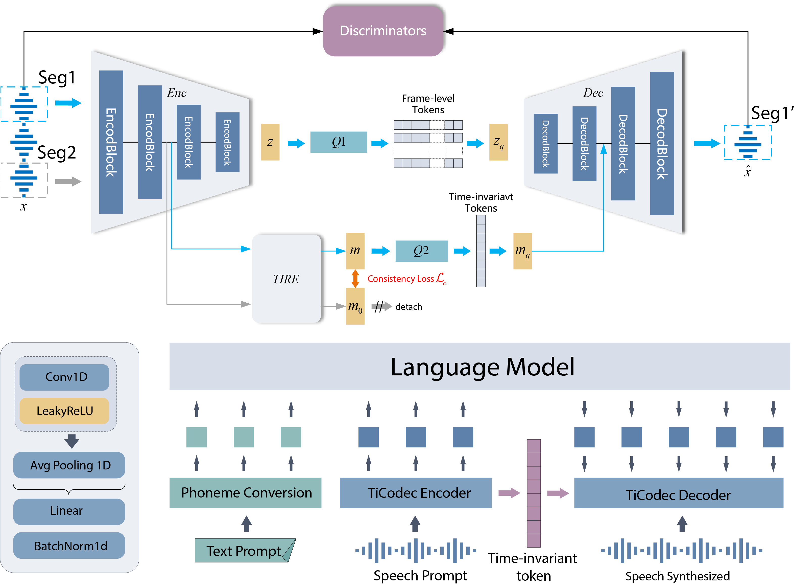

# TiCodec: Fewer-token Neural Speech Codec with Time-invariant Codes. (ICASSP 2024)

<p align="center">
        🤗 <a href="https://huggingface.co/y-ren16/TiCodec">Hugging Face</a>&nbsp&nbsp | &nbsp&nbsp🖥️ <a href="https://y-ren16.github.io/TiCodec">Demo</a> | &nbsp&nbsp📑 <a href="https://arxiv.org/pdf/2310.00014">Paper</a>&nbsp&nbsp
<br>

## 1. Introduction

Language model based text-to-speech (TTS) models, like VALL-E, have gained attention for their outstanding in-context learning capability in zero-shot scenarios. Neural speech codec is a critical component of these models, which can convert speech into discrete token
representations. However, excessive token sequences from the codec may negatively affect prediction accuracy and restrict the progression of Language model based TTS models. To address this issue, this paper proposes a novel neural speech codec with time-invariant
codes named TiCodec. By encoding and quantizing time-invariant information into a separate code, TiCodec can reduce the amount of frame-level information that needs encoding, effectively decreasing the number of tokens as codes of speech. Furthermore, this paper introduces a time-invariant encoding consistency loss to enhance the consistency of time-invariant code within an utterance, which can benefit the zero-shot TTS task. Experimental results demonstrate that TiCodec can not only enhance the quality of reconstruction speech with fewer tokens but also increase the similarity and
naturalness, as well as reduce the word error rate of the synthesized speech by the TTS model.

<div align="center">
  
</div>

## 2. Quick Started
### 2.1 Dependencies
```
pip install -r requirement.txt
```
Install [visqol](visqol) for calculating objective metrics.
### 2.2 Dataset preparation
Gengenerate ``./Lib_resources/*/*.lst`` for training.
```
.
├── Lib_resources
│   └── LibriTTS
│       ├── dev.lst
│       ├── test.lst
│       └── train.lst
```
Put ``*.wav`` in ``./egs/Paper_Data/GT/*/*.wav`` for metrics.
```
.
├── Paper_Data
│   ├── GEN
│   └── GT
```
### 2.3 Train
```
cd TiCodec/egs/TiCodec-24k-320d
bash start_conv_1g1r_8g3k1s_cos_from_head.sh
bash start_conv_1g2r_8g3k1s_cos_from_head.sh
bash start_conv_1g4r_8g3k1s_cos_from_head.sh
```
### 2.4 Test
```
test_conv_1g1r_8g3k1s_cos_from_head.sh
test_conv_1g2r_8g3k1s_cos_from_head.sh
test_conv_1g4r_8g3k1s_cos_from_head.sh
```
### 2.5 Metrics
```
python metrics.py
```
## 3. Citations
If our code and paper help you, please kindly cite:
```
@article{ren2023fewer,
  title={Fewer-token Neural Speech Codec with Time-invariant Codes},
  author={Ren, Yong and Wang, Tao and Yi, Jiangyan and Xu, Le and Tao, Jianhua and Zhang, Chuyuan and Zhou, Junzuo},
  journal={arXiv preprint arXiv:2310.00014},
  year={2023}
}
```

## 4. Acknowledgements
This implementation uses parts of the code from the following Github repos: [AcademiCodec](https://github.com/yangdongchao/AcademiCodec)

## License Agreement

**License**: The repository is licensed under the [Apache 2.0](LICENSE) License. 